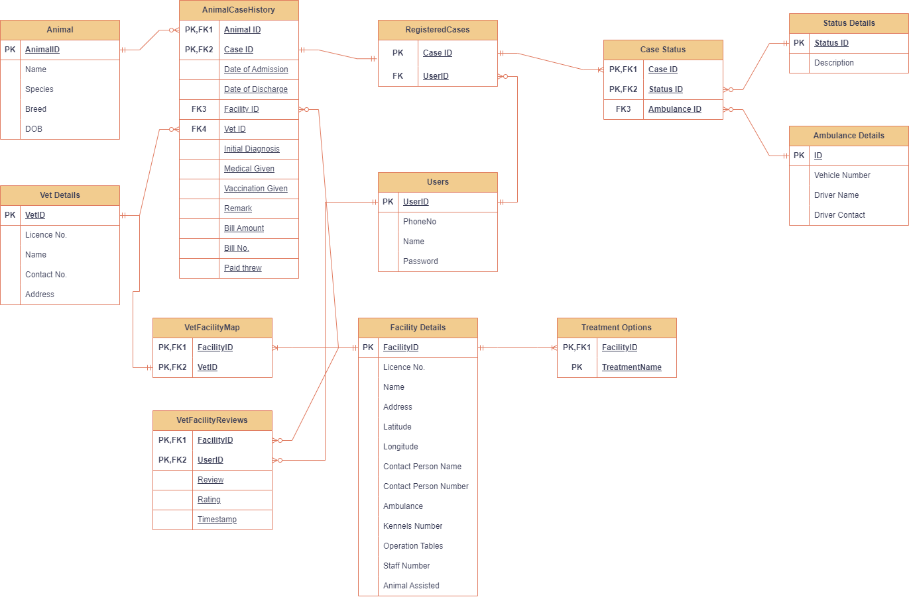

## AI for Stray Animals Rehabilitation and Aid - ASARA

### Problem Statement -
1. Thousands of stray animals die on streets every day because of lack of timely medical intervention.
2. Injured or distressed animals are also a public health concern as they may get aggressive.
3. Government funded programs are too few and far between and just do not have the right tech resources available to be present where they are actually needed.

### Opportunity
1. Using digitization there is a big opportunity to create an efficient and accountable method for citizens to request help and for volunteers and animal aid organizations to provide help at the right place and the right time.
2. If technology can empower every citizen of India to help a diseased stray animal as a first responder, it will help save the animal and also bring down the case loads for animal hospitals and shelters.
3. Digitization will also enable the animal aid organizations to send the help in time.
4. Technology can also help digitize India’s stray animals, thus enabling the Government of India to implement programs for animal `neutering` and `vaccination`, allocating funds to right animal aid organizations etc.
5. Pet industry in India is `900M USD`, growing at `19% CAGR`. The technology platform once established will be used by the citizens who are animal lovers and pet parents. 
6. It can be used for advertising the pet care products for a constant revenue source.

### Solution - 
1. A potential solution to address the challenges faced by community animals on Indian streets, who are at risk of accidents and cruelty on a daily basis, involves harnessing the power of AI. 
2. This solution aims to connect concerned citizens, ambulances, nearby hospitals, shelters, and compassionate community caregivers in a coordinated effort to provide timely and immediate assistance to distressed animals.
3. By leveraging AI technology, we can create a system that matches the animal in distress with the closest available help and volunteers who are equipped to provide animal care. 
4. This innovative approach would not only empower citizens to assist animals effectively but also ensure that the relevant authorities and caregivers are promptly informed of the animal's location and condition. 
5. This way, we can enhance the overall well-being and safety of community animals while encouraging a more compassionate and responsive society.

## Architecture Diagram

### Schema Diagram

## Future Scope
1. `ASARA` app Integration with Housing Society Management apps like `MyGate` to institutionalize stray animal management by `Resident Welfare Associations (RWA)`.
2. Increase transparency in `NGO` funding linked to number of animals assisted and ratings on `ASARA` app.
3. Feeder community collaboration through `ASARA` app to save valuable food resources by preventing over feeding.
4. Build feature to raise funds for animal welfare from `volunteers`, `RWAs`, `Corporate Houses` and `NGOs`.

## Resource Used
### a) Azure Computer Vision Service
1. [Image Vectorization](https://learn.microsoft.com/en-us/rest/api/computervision/2023-02-01-preview/image-retrieval/vectorize-image?tabs=HTTP)
2. [Azure Computer Vision POC Repo](https://github.com/piyush-gupta1999/ComputerVisionService)  
3. [AI Solution for Image/Video Caption](https://scenex.jina.ai/scenes)  

### b) Azure Functions
1. [Enable Streaming Execution Logs in Azure Function](https://learn.microsoft.com/en-us/azure/azure-functions/streaming-logs?tabs=azure-portal)  

### c) Azure IOT Hub
1. [Send telemetry from an IoT Plug and Play device to Azure IoT Hub](https://learn.microsoft.com/en-us/azure/iot-develop/quickstart-send-telemetry-iot-hub?pivots=programming-language-python)  
2. [Process real-time vehicle data using IoT](https://learn.microsoft.com/en-us/azure/architecture/example-scenario/data/realtime-analytics-vehicle-iot)  

### d) Azure Maps
1. [Azure Maps Routing Packages](https://learn.microsoft.com/en-us/python/api/azure-maps-route/azure.maps.route?view=azure-python-preview)  
2. [Azure Maps Longitude/Latitude Classes](https://learn.microsoft.com/en-us/python/api/azure-maps-route/azure.maps.route.models.latlon?view=azure-python-preview)  
3. [Create a Python function in Azure](https://learn.microsoft.com/en-us/azure/azure-functions/create-first-function-vs-code-python?pivots=python-mode-configuration)  

## Team Members
1. Neha Vairagade
2. Nidhi Hasija
3. Suvam Banerjee
4. Piyush Gupta
5. Naveen Panwar
6. Bhavya Hoda 
7. Kannupriya LNU 
8. Amithsha S